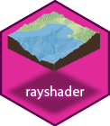
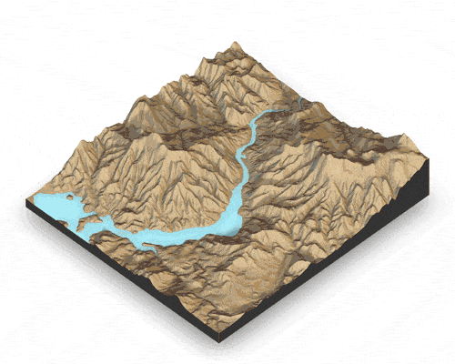
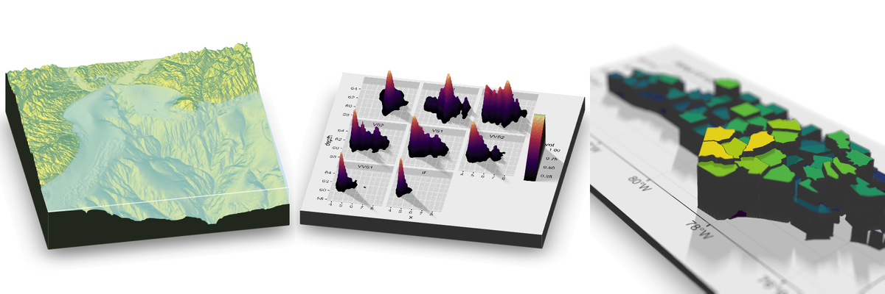

rayshader
=========================================================
</img>

Overview
--------

**rayshader** is an open source package for producing 2D and 3D data visualizations in R. **rayshader** uses elevation data in a base R matrix and a combination of raytracing, hillshading algorithms, and overlays to generate stunning 2D and 3D maps. In addition to maps, **rayshader** also allows the user to translate **ggplot2** objects into beautiful 3D data visualizations.

The models can be rotated and examined interactively or the camera movement can be scripted to create animations. Scenes can also be rendered using a high-quality pathtracer, **rayrender**. The user can also create a cinematic depth of field post-processing effect to direct the user's focus to important regions in the figure. The 3D models can also be exported to a 3D-printable format with a built-in STL export function, and can be exported to an OBJ file.

Installation
------------

``` r
# To install the latest version from Github:
# install.packages("devtools")
devtools::install_github("tylermorganwall/rayshader")
```

On Ubuntu, the following libraries are required:

```bash
libpng-dev libjpeg-dev libfreetype6-dev libglu1-mesa-dev libgl1-mesa-dev pandoc zlib1g-dev libicu-dev libgdal-dev gdal-bin libgeos-dev libproj-dev
```

Functions
---------


Rayshader has several functions related to mapping:

- `ray_shade()` uses user specified light directions to calculate a global shadow map for an elevation matrix. By default, this also scales the light intensity at each point by the dot product of the mean ray direction and the surface normal (also implemented in function `lamb_shade`, this can be turned off by setting `lambert=FALSE`.
- `sphere_shade()` maps an RGB texture to a hillshade by spherical mapping. A texture can be generated with the `create_texture` function, or loaded from an image. `sphere_shade` also includes 7 built-in palettes: "imhof1", "imhof2", "imhof3", imhof4", "desert", "bw", "unicorn". 
- `ambient_shade()` creates an ambient occlusion shadow layer, darkening areas that have less scattered light from the atmosphere. This results in valleys being darker than flat areas and ridges. 
- `texture_shade()` calculates a shadow for each point on the surface using the method described by Leland Brown in "Texture Shading: A New Technique for Depicting Terrain Relief."
- `height_shade()` calculates a color for each point on the surface using a direct elevation-to-color mapping.
- `calculate_normal()` calculates the normal unit vector for every point on the grid.
- `lamb_shade()` uses a single user specified light direction to calculate a local shadow map based on the dot product between the surface normal and the light direction for an elevation matrix. 
- `constant_shade()` generates a constant color layer.
- `cloud_shade()` renders shadows from the 3D floating cloud layer on the ground, which can be added to the map with `add_shadow()`.
- `radiance_shade()` renders a top-down radiance pass of the current 3D scene or a supplied elevation matrix, returning an overlay that can be added with `add_overlay()`.
- `add_shadow()` takes two of the shadow maps above and combines them, scaling the second one (or, if the second is an RGB array, the matrix) as specified by the user.
- `add_overlay()` takes a 3 or 4-layer RGB/RGBA array and overlays it on the current map. If the map includes transparency, this is taken into account when overlaying the image. Otherwise, the user can specify a single color that will be marked as completely transparent, or set the full overlay as partly transparent.
- `create_texture()`  programmatically creates texture maps given five colors: a highlight, a shadow, a left fill light, a right fill light, and a center color for flat areas. The user can also optionally specify the colors at the corners, but `create_texture` will interpolate those if they aren't given.

Rayshader also has functions to add water and generate overlays:

- `detect_water()` uses a flood-fill algorithm to detect bodies of water of a user-specified minimum area. 
- `add_water()` uses the output of `detect_water` to add a water color to the map. The user can input their own color, or pass the name of one of the pre-defined palettes from `sphere_shade` to get a matching hue.
- `generate_altitude_overlay()` uses a hillshade and the height map to generate a semi-transparent hillshade whose transparency varies with altitude. 
- `generate_compass_overlay()` generates an overlay with a compass.
- `generate_contour_overlay()` calculates and returns an overlay of contour lines.
- `generate_label_overlay()` this uses the `maptools::placeLabel()` function to generate labels for the given scene. Either use an `sf` object or manually specify the x/y coordinates and label.
- `generate_line_overlay()` generates an overlay of lines, using an `sf` object with LINESTRING geometry.
- `generate_point_overlay()` generates an overlay of points, using an `sf` object with POINT geometry.
- `generate_polygon_overlay()` generates an overlay of points, using an `sf` object with POLYGON geometry.
- `generate_scalebar_overlay()` this function creates an overlay with a scale bar of a user-specified length. It uses the coordinates of the map (specified by passing an extent) and then creates a scale bar at a specified x/y proportion across the map. If the map is not projected (i.e. is in lat/long coordinates) this function will use the `geosphere` package to create a scale bar of the proper length.
- `generate_waterline_overlay()` generates a semi-transparent waterline overlay to layer onto an existing map using a height map or a boolean matrix.

Also included are functions to add geometry, effects, and information to your 3D visualizations:

-  `render_highquality()` renders in the scene with a built-in pathtracer, powered by the **rayrender** package. Use this for high-quality maps with realistic light transport.
-  `render_depth()` generates a depth of field effect for the 3D map. The user can specify the focal distance, focal length, and f-stop of the camera, as well as aperture shape and bokeh intensity. This either plots the image to the local device, or saves it to a file if given a filename.
-  `render_label()` adds a text label to the `x` and `y` coordinate of the map at a specified altitude `z` (in units of the matrix). The altitude can either be specified relative to the elevation at that point (the default), or absolutely. 
- `render_contours()` adds 3D contours to the current scene, using the heightmap of the 3D surface.
- `render_floating_overlay()` renders a 2D floating overlay over the map.
- `render_clouds()` renders a 3D floating cloud layer over the map.
- `render_water()` adds a 3D tranparent water layer to 3D maps, after the rgl device has already been created. This can either add to a map that does not already have a water layer, or replace an existing water layer on the map.
- `render_compass()` places a compass on the map in 3D.
- `render_path()` adds a 3D path to the current scene, using latitude/longitude or coordinates in the cached scene CRS/extent. If no altitude is provided, the path will be elevated a constant offset above the heightmap.
- `render_points()` Adds 3D points to the current scene, using latitude/longitude or coordinates in the cached scene CRS/extent. If no altitude is provided, the points will be elevated a constant offset above the heightmap.
- `render_polygons()` Adds 3D polygons to the current scene, using latitude/longitude or coordinates in the cached scene CRS/extent.
- `render_beveled_polygons()` adds beveled polygons to the current scene using the **raybevel** package.
- `render_buildings()` adds 3D polygons with roofs to the current scene.
- `render_multipolygonz()` adds `MULTIPOLYGON Z` geometry directly to the current scene.
- `render_obj()` adds a 3D OBJ model to the current scene, using x/y coordinates in the cached scene CRS/extent.
- `render_raymesh()` adds a 3D `ray_mesh` model to the current scene, using x/y coordinates in the cached scene CRS/extent.
- `render_tree()` adds 3D representations of trees to the current scene.
- `render_scalebar()` places a scalebar on the map in 3D.
- `render_zaxis()` adds a standalone z-axis to the current scene.
- `render_resize_window()` resizes the rgl window.

And several helper functions for working with terrain matrices:

- `raster_to_matrix()` converts a `raster` objects into a matrix.
- `resize_matrix()` resizes a matrix (preserving contents) by specifying the desired output dimensions or a scaling factor.

And several functions to display, save, and export your visualizations:

- `plot_map()` Plots the current map. Accepts either a matrix or an array.
- `save_png()` writes an image to disk with a user-specified filename.
- `plot_3d()` Creates a 3D map, given a texture and elevation matrix, or a cached heightmap from a rayshader pipe. You can customize the appearance of the map, as well as add a user-defined water level.
- `render_camera()` Changes the camera orientation.
- `render_snapshot()` Saves an image of the current 3D view to disk (if given a filename), or plots the 3D view to the current device (useful for including images in R Markdown files).
- `render_movie()` Creates and saves a mp4/gif file of the camera rotating around the 3D scene by either using a built-in orbit or by using one provided by the user.
- `convert_path_to_animation_coords()` transforms path coordinates into the reference system used by `render_highquality()`, so they can be passed to `animation_camera_coords`.
- `convert_rgl_to_raymesh()` converts the current rayshader RGL scene to a `ray_mesh` object.
- `save_obj()` writes the textured 3D rayshader visualization to an OBJ file.
- `save_3dprint()` writes a stereolithography (STL) file that can be used in 3D printing.
- `save_multipolygonz_to_obj()` converts `MULTIPOLYGON Z` `sf` features into a 3D OBJ file.

Also included are helper objects and utilities for custom scene elements:

- `flag_full_obj()` returns a 3D flag OBJ model for use with `render_obj()`.
- `flag_banner_obj()` returns the banner portion of the built-in flag OBJ, so it can be styled separately from the pole.
- `flag_pole_obj()` returns the pole portion of the built-in flag OBJ, so it can be styled separately from the banner.

Finally, rayshader has a single function to generate 3D plots using ggplot2 objects:

- `plot_gg()` Takes a ggplot2 object (or a list of two ggplot2 objects) and uses the fill or color aesthetic to transform the plot into a 3D surface. You can pass any of the arguments used to specify the camera and the background/shadow colors in `plot_3d()`, and manipulate the displayed 3D plot using `render_camera()` and `render_depth()`.

Usage
-----

```{r setup, include = FALSE}
library(knitr)
library(rgl)
rgl::setupKnitr(autoprint = FALSE)

knitr::opts_chunk$set(
  warning = FALSE,
	fig.path = "man/figures/",
	cache = TRUE
)
set.seed(1001)
```

Rayshader can be used for two purposes: both creating hillshaded maps and 3D data visualizations plots. First, let's look at rayshader's mapping capabilities. For the latter, scroll below.

## Mapping with rayshader 

```{r README_basicmapping, warning = FALSE}
library(rayshader)

#Here, I load a map with the raster package.
loadzip = tempfile()
download.file("https://tylermw.com/data/dem_01.tif.zip", loadzip)
elmat = raster::raster(unzip(loadzip, "dem_01.tif"))
unlink(loadzip)

#We use another one of rayshader's built-in textures:
elmat |>
	sphere_shade(texture = "desert") |>
	plot_map()

#sphere_shade can shift the sun direction:
elmat |>
	sphere_shade(sunangle = 45, texture = "desert") |>
	plot_map()

#detect_water and add_water adds a water layer to the map:
elmat |>
	sphere_shade(texture = "desert") |>
	add_water(detect_water(), color = "desert") |>
	plot_map()

#And we can add a raytraced layer from that sun direction as well:
elmat |>
	sphere_shade(texture = "desert") |>
	add_water(detect_water(), color = "desert") |>
	add_shadow(ray_shade(), 0.5) |>
	plot_map()

#And here we add an ambient occlusion shadow layer, which models
#lighting from atmospheric scattering:

elmat |>
	sphere_shade(texture = "desert") |>
	add_water(detect_water(), color = "desert") |>
	add_shadow(ray_shade(), 0.5) |>
	add_shadow(ambient_shade(maxsearch = 30), 0) |>
	plot_map()
```

For a more physically-based top-down lighting pass, `radiance_shade()` renders an orthographic radiance overlay using the same pathtracing backend as `render_highquality()`. This returns an RGBA array, so you can blend it directly into an existing 2D map with `add_overlay()`, or use it on it's own.

```{r README_radiance}
desert_water = elmat |>
	sphere_shade(texture = "desert") |>
	add_water(detect_water(), color = "desert")

radiance_shade(
		texture = desert_water,
		zscale = 3,
		samples = 16, 
		lightdirection = 315,
		lightintensity = 800,
		lightaltitude = 50
	) |> 
	plot_map()
```

Rayshader also supports 3D mapping by passing a texture map (either external or one produced by rayshader) into the `plot_3d` function. 

```{r README_three-d, fig.width = 10, fig.height = 8}

elmat |>
	sphere_shade(texture = "desert") |>
	add_water(detect_water(), color = "desert") |>
	add_shadow(ray_shade(zscale = 3), 0.3) |>
	add_shadow(ambient_shade(), 0) |>
	plot_3d(
		zscale = 10,
		fov = 0,
		theta = 135,
		zoom = 0.75,
		phi = 45,
		windowsize = c(1000, 800)
	)
Sys.sleep(0.2)
render_snapshot()

```

You can add a scale bar, as well as a compass using `render_scalebar()` and `render_compass()`

```{r scalebar, fig.width = 10, fig.height = 8}
render_camera(fov = 0, theta = 60, zoom = 0.75, phi = 45)
render_scalebar(
	limits = c(0, 5, 10),
	label_unit = "km",
	position = "W",
	y = 50,
	scale_length = c(0.33, 1)
)
render_compass(position = "E")
render_snapshot(clear = TRUE)

```

Rayshader also includes the option to add a procedurally-generated cloud layer (and optionally, shadows):

```{r clouds, fig.width = 10, fig.height = 8}

elmat |>
	sphere_shade(texture = "desert") |>
	add_water(detect_water(), color = "lightblue") |>
	add_shadow(
		cloud_shade(
			elmat,
			zscale = 10,
			start_altitude = 500,
			end_altitude = 1000,
		),
		0
	) |>
	plot_3d(
		zscale = 10,
		fov = 0,
		theta = 135,
		zoom = 0.75,
		phi = 45,
		windowsize = c(1000, 800),
		background = "darkred"
	)
render_camera(theta = 20, phi = 40, zoom = 0.64, fov = 56)

render_clouds(
	start_altitude = 800,
	end_altitude = 1000,
	attenuation_coef = 5,
	sun_altitude = 10,
	clear_clouds = T
)
render_snapshot(clear = TRUE)
rgl::rgl.clear()

```

These clouds can be customized:

```{r clouds2, fig.width = 10, fig.height = 8}

elmat |>
	sphere_shade(texture = "desert") |>
	add_water(detect_water(), color = "lightblue") |>
	add_shadow(
		cloud_shade(
			elmat,
			zscale = 10,
			start_altitude = 500,
			end_altitude = 700,
			sun_altitude = 45,
			attenuation_coef = 2,
			offset_y = 300,
			cloud_cover = 0.55,
			frequency = 0.01,
			scale_y = 3,
			fractal_levels = 32
		),
		0
	) |>
	plot_3d(
		zscale = 10,
		fov = 0,
		theta = 135,
		zoom = 0.75,
		phi = 45,
		windowsize = c(1000, 800),
		background = "darkred"
	)
render_camera(theta = 125, phi = 22, zoom = 0.47, fov = 60)

render_clouds(
	start_altitude = 500,
	end_altitude = 700,
	sun_altitude = 45,
	attenuation_coef = 2,
	offset_y = 300,
	cloud_cover = 0.55,
	frequency = 0.01,
	scale_y = 3,
	fractal_levels = 32,
	clear_clouds = T
)
render_snapshot(clear = TRUE)

```

```{r include = FALSE}
rgl::close3d()
```

You can also render using the built-in pathtracer, powered by [rayrender](https://www.rayrender.net). Simply replace `render_snapshot()` with `render_highquality()`. When `render_highquality()` is called, there's no need to pre-compute the shadows with any of the `_shade()` functions, so we remove those:

```{r README_three-dhq, fig.width = 10, fig.height = 8}

elmat |> 
	sphere_shade(texture = "desert") |>
	add_water(detect_water(), color = "desert") |>
	plot_3d(
		zscale = 10,
		fov = 0,
		theta = 72,
		zoom = 0.68,
		phi = 40,
		shadowdepth = -100,
		soliddepth = -100,
		windowsize = c(1000, 800)
	)

render_scalebar(
	limits = c(0, 5, 10),
	label_unit = "km",
	position = "W",
	y = 50,
	scale_length = c(0.33, 1)
)

render_compass(position = "E")
Sys.sleep(0.2)
render_highquality(samples = 16, scale_text_size = 24) 

```

You can pass a latitude, longitude, and datetime to render this location with a realistic atmosphere and sun direction at that time and place, using the `skymodelr` package. Here's Hobart, Tasmania in the winter in the southern hemisphere.

```{r skymnodelr, fig.width = 10, fig.height = 8}
elmat_lat_long = c(-42.745792, 147.171103)
render_highquality(
	samples = 16,
	lat = elmat_lat_long[1],
	long = elmat_lat_long[2],
	iso = 5, clamp_value = 1000,
	datetime = as.POSIXct("2025-06-21 15:00:00", tz = "Australia/Sydney"), 
	sky_args = list(hosek = FALSE),
	width=1000, height=800
) 
```

Here's the same location at noon. This is the southern hemisphere, so the light is coming from north, as noted by the compass.

```{r skymnodelr2, fig.width = 10, fig.height = 8}
render_highquality(
	samples = 16,
	lat = elmat_lat_long[1],
	long = elmat_lat_long[2],
	iso = 5, clamp_value = 1000,
	datetime = as.POSIXct("2025-06-21 12:00:00", tz = "Australia/Sydney"),
	sky_args = list(hosek = FALSE),
	width=1000, height=800 
)
```


```{r include = FALSE}
rgl::close3d()
system("rm dem_01.tif")
```

You can also easily add a water layer by setting `water = TRUE` in `plot_3d()` (and setting `waterdepth` if the water level is not 0), or by using the function `render_water()` after the 3D map has been rendered. You can customize the appearance and transparancy of the water layer via function arguments. Here's an example using bathymetric/topographic data of Monterey Bay, CA (included with rayshader):

```{r README_three-d-water, fig.width =  10, fig.height = 8}

montereybay |>
	sphere_shade(texture = "imhof1") |>
	add_shadow(ray_shade(vertical_exaggeration = 4, lambert = FALSE), 0.5) |>
	add_shadow(ambient_shade(vertical_exaggeration = 4), 0) |>
	plot_3d(
		vertical_exaggeration = 4,
		fov = 0,
		theta = -45,
		phi = 45,
		windowsize = c(1000, 800),
		zoom = 0.75,
		water = TRUE,
		waterdepth = 0,
		wateralpha = 0.5,
		watercolor = "lightblue",
		waterlinecolor = "white",
		waterlinealpha = 0.5
	)
Sys.sleep(0.2)
render_snapshot(clear = TRUE)
```

Water is also supported in `render_highquality()`. We load the `rayrender` package to change the ground material to include a checker pattern. By default, the camera looks at the origin, but we shift it down slightly to center the map.

```{r hq, fig.width =  10, fig.height = 8, output = FALSE, warning = FALSE, message = FALSE}
library(rayrender)

montereybay |>
	sphere_shade(texture = "imhof1") |>
	plot_3d(
		vertical_exaggeration = 4,
		fov = 70,
		theta = 270,
		phi = 30,
		windowsize = c(1000, 800),
		zoom = 0.6,
		water = TRUE,
		waterdepth = 0,
		wateralpha = 0.5,
		watercolor = "#233aa1",
		waterlinecolor = "white",
		waterlinealpha = 0.5
	)
Sys.sleep(0.2)
render_highquality(
	lightdirection = c(-45, 45),
	lightaltitude = 30,
	samples = 16,
	camera_lookat = c(0, -50, 0),
	ground_material = diffuse(
		color = "grey50",
		checkercolor = "grey20",
		checkerperiod = 100
	),
	clear = TRUE
)


```

Rayshader also has map shapes other than rectangular included `c("hex", "circle")`, and you can customize the map into any shape you want by setting the areas you do not want to display to `NA`. 

```{r  README_three-d-shapes, fig.width = 12, fig.height = 6, output = FALSE}
par(mfrow = c(1, 2))
montereybay |>
	sphere_shade(texture = "imhof1") |>
	add_shadow(ray_shade(vertical_exaggeration = 4, lambert = FALSE), 0.5) |>
	add_shadow(ambient_shade(vertical_exaggeration = 4), 0) |>
	plot_3d(
		vertical_exaggeration = 4,
		fov = 0,
		theta = -45,
		phi = 45,
		windowsize = c(1000, 800),
		zoom = 0.6,
		water = TRUE,
		waterdepth = 0,
		wateralpha = 0.5,
		watercolor = "lightblue",
		waterlinecolor = "white",
		waterlinealpha = 0.5,
		baseshape = "circle"
	)

render_snapshot(clear = TRUE)

montereybay |>
	sphere_shade(texture = "imhof1") |>
	add_shadow(ray_shade(vertical_exaggeration = 4, lambert = FALSE), 0.5) |>
	add_shadow(ambient_shade(vertical_exaggeration = 4), 0) |>
	plot_3d(
		vertical_exaggeration = 4,
		fov = 0,
		theta = -45,
		phi = 45,
		windowsize = c(1000, 800),
		zoom = 0.6,
		water = TRUE,
		waterdepth = 0,
		wateralpha = 0.5,
		watercolor = "lightblue",
		waterlinecolor = "white",
		waterlinealpha = 0.5,
		baseshape = "hex"
	)

render_snapshot(clear = TRUE)
```

Adding text labels is done with the `render_label()` function, which also allows you to customize the line type, color, and size along with the font:

```{r README_three-d-labels, fig.width =  10, fig.height = 8, output = FALSE, message = FALSE}
montereybay |>
	sphere_shade(texture = "imhof1") |>
	add_shadow(ray_shade(vertical_exaggeration = 4, lambert = FALSE), 0.5) |>
	add_shadow(ambient_shade(vertical_exaggeration = 4), 0) |>
	plot_3d(
		vertical_exaggeration = 4,
		fov = 0,
		theta = -100,
		phi = 30,
		windowsize = c(1000, 800),
		zoom = 0.6,
		water = TRUE,
		waterdepth = 0,
		waterlinecolor = "white",
		waterlinealpha = 0.5,
		wateralpha = 0.5,
		watercolor = "lightblue"
	)
moss_landing_coord = c(36.806807, -121.793332)
santa_cruz = c(36.962957, -122.021033)
monterey = c(36.603053, -121.892933)
canyon = c(36.621049, -122.333912)
render_label(
	lat = moss_landing_coord[1],
	long = moss_landing_coord[2],
	altitude = 1000,
	text = "Moss Landing",
	textsize = 2,
	linewidth = 5
)
render_label(
	lat = santa_cruz[1],
	long = santa_cruz[2],
	altitude = 7000,
	text = "Santa Cruz",
	textcolor = "darkred",
	linecolor = "darkred",
	textsize = 2,
	linewidth = 5
)
render_label(
	lat = monterey[1],
	long = monterey[2],
	altitude = 4000,
	text = "Monterey",
	dashed = TRUE,
	textsize = 2,
	linewidth = 5
)
render_label(
	lat = canyon[1],
	long = canyon[2],
	altitude = 1000,
	textcolor = "white",
	linecolor = "white",
	text = "Monterey Canyon",
	relativez = FALSE,
	textsize = 2,
	linewidth = 5
)
Sys.sleep(0.2)
render_snapshot(clear = TRUE)
```

Labels are also supported in `render_highquality()`:

```{r include=FALSE}
montereybay |>
	sphere_shade(texture = "imhof1") |>
	plot_3d(
		vertical_exaggeration = 4,
		fov = 0,
		theta = -100,
		phi = 30,
		windowsize = c(1000, 800),
		zoom = 0.6,
		water = TRUE,
		waterdepth = 0,
		waterlinecolor = "white",
		waterlinealpha = 0.5,
		wateralpha = 0.5,
		watercolor = "#233aa1"
	)
render_label(
	lat = moss_landing_coord[1],
	long = moss_landing_coord[2],
	altitude = 1000,
	text = "Moss Landing",
	textsize = 2,
	linewidth = 5
)
render_label(
	lat = santa_cruz[1],
	long = santa_cruz[2],
	altitude = 7000,
	text = "Santa Cruz",
	textcolor = "darkred",
	linecolor = "darkred",
	textsize = 2,
	linewidth = 5
)
render_label(
	lat = monterey[1],
	long = monterey[2],
	altitude = 4000,
	text = "Monterey",
	dashed = TRUE,
	textsize = 2,
	linewidth = 5
)
render_label(
	lat = canyon[1],
	long = canyon[2],
	altitude = 1000,
	textcolor = "white",
	linecolor = "white",
	text = "Monterey Canyon",
	relativez = FALSE,
	textsize = 2,
	linewidth = 5
)

```

```{r README_hqlabels, fig.width =  10, fig.height = 8, output = FALSE}

render_highquality(
	samples = 16,
	line_radius = 1,
	text_size = 36,
	text_offset = c(0, 12, 0),
	clear = TRUE 
)

```

3D paths, points, and polygons can be added directly from spatial objects from the `sf` library:

Polygons:

```{r README_polygon, fig.width =  10, fig.height = 8, warning=FALSE, message=FALSE, output = FALSE}

montereybay |>
	sphere_shade(texture = "desert") |>
	add_shadow(ray_shade(vertical_exaggeration = 4)) |>
	plot_3d(
		water = TRUE,
		windowsize = c(1000, 800),
		watercolor = "dodgerblue"
	)
render_camera(theta = -60, phi = 60, zoom = 0.85, fov = 30)

#We will apply a negative buffer to create space between adjacent polygons:
sf::sf_use_s2(FALSE)
mont_county_buff = sf::st_simplify(
	sf::st_buffer(monterey_counties_sf, -0.003),
	dTolerance = 0.004
)

render_polygons(
	mont_county_buff,
	data_column_top = "ALAND",
	scale_data = 300 / (2.6E9),
	color = "chartreuse4",
	parallel = TRUE
)
render_highquality(samples = 16)
render_polygons(clear_previous = TRUE)
render_camera(theta = 225, phi = 30, zoom = 0.37, fov = 48)


```

Points:

```{r README_points, fig.width =  10, fig.height = 8, output = FALSE}

moss_landing_coord = c(36.806807, -121.793332)
x_vel_out = -0.0018 + rnorm(1000)[1:300] / 1000
y_vel_out = rnorm(1000)[1:300] / 100
z_out = c(
	seq(0, 2000, length.out = 180),
	seq(2000, 0, length.out = 10),
	seq(0, 2000, length.out = 100),
	seq(2000, 0, length.out = 10)
)

bird_track_lat = list()
bird_track_long = list()
bird_track_lat[[1]] = moss_landing_coord[1]
bird_track_long[[1]] = moss_landing_coord[2]

for (i in 2:300) {
	bird_track_lat[[i]] = bird_track_lat[[i - 1]] + y_vel_out[i]
	bird_track_long[[i]] = bird_track_long[[i - 1]] + x_vel_out[i]
}

render_points(
	lat = unlist(bird_track_lat),
	long = unlist(bird_track_long),
	altitude = z_out,
	size = 3,
	color = "red",
	clear_previous = TRUE
)
render_highquality(point_radius = 0.5, samples = 16)
render_points(clear_previous = TRUE)
```

Paths:

```{r README_paths, fig.width =  10, fig.height = 8, output = FALSE}

render_path(
	lat = unlist(bird_track_lat),
	long = unlist(bird_track_long),
	altitude = z_out,
	linewidth = 3,
	color = "white",
	antialias = TRUE
)
render_highquality(
	line_radius = 0.5,
	samples = 16,
	clear = TRUE,
	use_extruded_paths = TRUE
)

```

You can also apply a post-processing effect to the 3D maps to render maps with depth of field with the `render_depth()` function:

```{r README_three-d-depth, fig.width = 10, fig.height = 8}

elmat |>
	sphere_shade(texture = "desert") |>
	add_water(detect_water(), color = "desert") |>
	add_shadow(ray_shade(zscale = 3), 0.5) |>
	add_shadow(ambient_shade(), 0) |>
	plot_3d(
		zscale = 10,
		fov = 30,
		theta = -225,
		phi = 25,
		windowsize = c(1000, 800),
		zoom = 0.3
	)
Sys.sleep(0.2)
render_depth(focallength = 800, clear = TRUE) #THIS NEEDS FIXING

```

## 3D plotting with rayshader and ggplot2

Rayshader can also be used to make 3D plots out of ggplot2 objects using the `plot_gg()` function. Here, I turn a color density plot into a 3D density plot. `plot_gg()` detects that the user mapped the `fill` aesthetic to color and uses that information to project the figure into 3D. 

```{r README_ggplots, fig.show='hide', fig.width = 10, fig.height = 5, output=FALSE, warning = FALSE}
library(ggplot2)
ggdiamonds = ggplot(diamonds, aes(x, depth)) +
	stat_density_2d(
		aes(fill = after_stat(nlevel), color = after_stat(nlevel)),
		geom = "polygon",
		n = 200,
		bins = 50,
		contour = TRUE
	) +
	facet_wrap(clarity ~ .) +
	scale_fill_viridis_c(option = "A") +
	scale_color_viridis_c(option = "A")

# Return a preview snapshot
gg1 = plot_gg(
	ggdiamonds,
	width = 5,
	height = 5,
	raytrace = FALSE,
	preview = TRUE
)
# Plot in 3D
plot_gg(
	ggdiamonds,
	width = 5,
	height = 5,
	multicore = TRUE,
	scale = 250,
	zoom = 0.7,
	theta = 10,
	phi = 30,
	windowsize = c(800, 800)
)
Sys.sleep(0.2)
gg2 = render_snapshot(clear = TRUE, plot = FALSE)
```

```{r README_ggplots_plot, fig.width = 10, fig.height = 5}
rayimage::plot_image_grid(list(gg1, gg2), dim = c(1, 2))

```

Rayshader will automatically ignore lines and other elements that should not be mapped to 3D. Here's a contour plot of the `volcano` dataset.

```{r README_ggplots_2, fig.show='hide', fig.width = 10, fig.height = 5, output=FALSE}
library(reshape2)
#Contours and other lines will automatically be ignored. Here is the volcano dataset:

ggvolcano = volcano |>
	melt() |>
	ggplot() +
	geom_tile(aes(x = Var1, y = Var2, fill = value)) +
	geom_contour(aes(x = Var1, y = Var2, z = value), color = "black") +
	scale_x_continuous("X", expand = c(0, 0)) +
	scale_y_continuous("Y", expand = c(0, 0)) +
	scale_fill_gradientn("Z", colours = terrain.colors(10)) +
	coord_fixed()

# Return a preview snapshot
gg3 = plot_gg(
	ggvolcano,
	width = 7,
	height = 4,
	raytrace = FALSE,
	preview = TRUE
)
# Plot in 3D
plot_gg(
	ggvolcano,
	multicore = TRUE,
	raytrace = TRUE,
	width = 7,
	height = 4,
	scale = 300,
	windowsize = c(1400, 866),
	zoom = 0.6,
	phi = 30,
	theta = 30
)
Sys.sleep(0.2)

gg4 = render_snapshot(clear = TRUE, plot = FALSE)
```

```{r README_ggplots_plot_2, fig.width = 10, fig.height = 5}
rayimage::plot_image_grid(list(gg3, gg4), dim = c(1, 2))
```

Rayshader also detects when the user passes the `color` aesthetic, and maps those values to 3D. If both `color` and `fill` are passed, however, rayshader will default to `fill`.

```{r README_ggplots_3, fig.show='hide', output=FALSE}
mtplot = ggplot(mtcars) +
	geom_point(aes(x = mpg, y = disp, color = cyl), size = 2) +
	scale_color_continuous(limits = c(0, 8))

# Return a preview snapshot
gg5 = plot_gg(mtplot, width = 3.5, raytrace = FALSE, preview = TRUE)

# Plot in 3D
plot_gg(
	mtplot,
	width = 3.5,
	multicore = TRUE, 
	windowsize = c(800, 800),
	zoom = 0.85,
	phi = 35, 
	theta = 30,
	sunangle = 225
)
Sys.sleep(0.2)
gg6 = render_snapshot(clear = TRUE, plot = FALSE)
```

```{r README_ggplots_plot_3, fig.width = 10, fig.height = 5}

rayimage::plot_image_grid(list(gg5, gg6), dim = c(1, 2))

```

Utilize combinations of line color and fill to create different effects. Here is a terraced hexbin plot, created by mapping the line colors of the hexagons to black. 

```{r README_ggplots_4, fig.show='hide', output=FALSE}
a = data.frame(x = rnorm(20000, 10, 1.9), y = rnorm(20000, 10, 1.2))
b = data.frame(x = rnorm(20000, 14.5, 1.9), y = rnorm(20000, 14.5, 1.9))
c = data.frame(x = rnorm(20000, 9.5, 1.9), y = rnorm(20000, 15.5, 1.9))
data = rbind(a, b, c)

#Lines 
pp = ggplot(data, aes(x = x, y = y, fill = after_stat(count))) +
	geom_hex(bins = 20, linewidth = 0.5, color = "black") +
	scale_fill_viridis_c(option = "C") +  
	scale_color_viridis_c(option = "C")

gg7 = plot_gg(
	pp, 
	width = 5, 
	height = 4,
	scale = 300,
	raytrace = FALSE,
	preview = TRUE
)
plot_gg(
	pp,   
	width = 5, 
	height = 4, 
	scale = 300, 
	multicore = TRUE,
	windowsize = c(1000, 800)
)
render_camera(fov = 70, zoom = 0.5, theta = 130, phi = 35)
Sys.sleep(0.2)
gg8 = render_snapshot(clear = TRUE, plot = FALSE)
```

```{r README_ggplots_plot_4, fig.width = 10, fig.height = 5}
 
rayimage::plot_image_grid(list(gg7, gg8), dim = c(1, 2)) 

```


You can also use the `render_depth()` function to direct the viewer's focus to a important areas in the figure.

```{r README_ggplots_5, fig.width = 10, fig.height = 8, output = FALSE, message = FALSE}

plot_gg(
	pp, 
	width = 5, 
	height = 4,
	scale = 300,
	multicore = TRUE, offset_edges = 0,
	windowsize = c(1200, 960), 
	fov = 70, 
	zoom = 0.4, 
	theta = 330,
	phi = 40
)
Sys.sleep(0.2)
render_depth(focallength = 600, focus = 1700, clear = TRUE)
```

Finally, you can increase the allowable error in triangulating the model to vastly reduce the size. Here, we reduce the model to 1/100th of it's raw (un-triangulated) size, while maintaining model quality. This can improve the performance when rendering 3D ggplots with `render_highquality()`, as well as improve performance on slower computers. This triangulation is powered by the {terrainmeshr} package. 

Here, we make a 3D ggplot out of glass, using a triangulated model and `render_highquality()`.

```{r README_ggplots_6, fig.width = 10, fig.height = 8, output=FALSE}
tempfilehdr = tempfile(fileext = ".hdr")
download.file("https://www.tylermw.com/data/venice_sunset_2k.hdr", tempfilehdr)

par(mfrow = c(1, 1))
plot_gg(
	pp, 
	width = 5,
	height = 4, 
	scale = 300,
	raytrace = FALSE,
	windowsize = c(1200, 960),
	fov = 129,
	zoom = 0.21,
	theta = -25,
	phi = 9,
	max_error = 0.01, 
	verbose = TRUE,
)
Sys.sleep(0.2)
render_highquality(
	samples = 16,
	aperture = 30,
	light = FALSE,
	override_material = TRUE, 
	focal_distance = 1043, 
	material = rayrender::dielectric(attenuation = c(1, 1, 0.3) / 200),
	ground_material = rayrender::diffuse(
		checkercolor = "grey80", 
		sigma = 90,
		checkerperiod = 100
	),
	environment_light = tempfilehdr,
	rotate_env = 180
)
```
