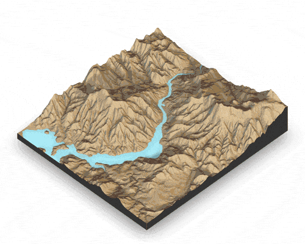
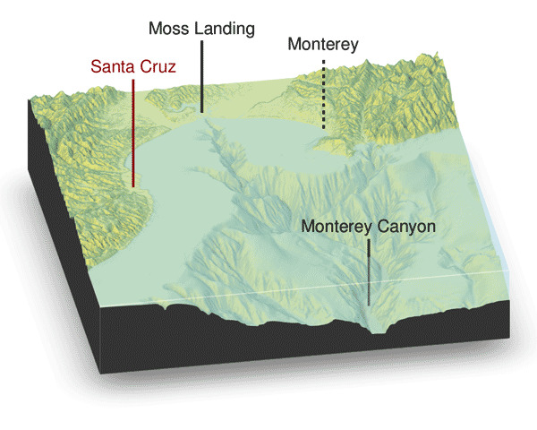
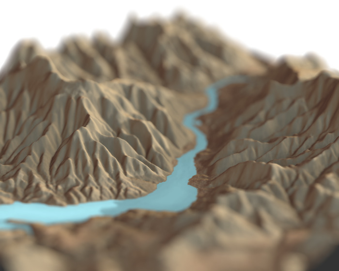

# rayshader

</img>

## Overview

**rayshader** is an open source R package for producing 2D and 3D
hillshaded maps of elevation matrices using a combination of raytracing,
spherical texture mapping, and ambient occlusion.

## Installation

``` r
# To install:
install.packages("rayshader")
# To install the latest version from Github (requires devtools):
devtools::install_github("tylermorganwall/rayshader")
```

## Functions


Rayshader has seven functions related to hillshading:

  - `ray_shade` uses user specified light directions to calculate a
    global shadow map for an elevation matrix. By default, this also
    scales the light intensity at each point by the dot product of the
    mean ray direction and the surface normal (also implemented in
    function `lamb_shade`, this can be turned off by setting
    `lambert=FALSE`.
  - `sphere_shade` maps an RGB texture to a hillshade by spherical
    mapping. A texture can be generated with the `create_texture`
    function, or loaded from an image. `sphere_shade` also includes 7
    built-in palettes:
    “imhof1”,“imhof2”,“imhof3”,imhof4“,”desert“,”bw“,”unicorn".
  - `create_texture` programmatically creates texture maps given five
    colors: a highlight, a shadow, a left fill light, a right fill
    light, and a center color for flat areas. The user can also
    optionally specify the colors at the corners, but `create_texture`
    will interpolate those if they aren’t given.
  - `ambient_shade` creates an ambient occlusion shadow layer, darkening
    areas that have less scattered light from the atmosphere. This
    results in valleys being darker than flat areas and ridges.
  - `lamb_shade` uses a single user specified light direction to
    calculate a local shadow map based on the dot product between the
    surface normal and the light direction for an elevation matrix.
  - `add_shadow` takes two of the shadow maps above and combines them,
    scaling the second one (or, if the second is an RGB array, the
    matrix) as specified by the user.
  - `add_overlay` takes a 3 or 4-layer RGB/RGBA array and overlays it on
    the current map. If the map includes transparency, this is taken
    into account when overlaying the image. Otherwise, the user can
    specify a single color that will be marked as completely
    transparent, or set the full overlay as partly transparent.

Rayshader also has three functions to detect and add water to maps:

  - `detect_water` uses a flood-fill algorithm to detect bodies of water
    of a user-specified minimum area.
  - `add_water` uses the output of `detect_water` to add a water color
    to the map. The user can input their own color, or pass the name of
    one of the pre-defined palettes from `sphere_shade` to get a
    matching hue.
  - `render_water` adds a 3D tranparent water layer to 3D maps, after
    the rgl device has already been created. This can either add to a
    map that does not already have a water layer, or replace an existing
    water layer on the map.

Also included are two functions to add additional effects and
information to your 3D visualizations:

  - `render_depth` generates a depth of field effect for the 3D map. The
    user can specify the focal distance, focal length, and f-stop of the
    camera, as well as aperture shape and bokeh intensity. This either
    plots the image to the local device, or saves it to a file if given
    a filename.
  - `render_label` adds a text label to the `x` and `y` coordinate of
    the map at a specified altitude `z` (in units of the matrix). The
    altitude can either be specified relative to the elevation at that
    point (the default), or absolutely.

And three functions to display and save your maps:

  - `plot_map` Plots the current map. Accepts either a matrix or an
    array.
  - `save_png` Writes the current map to disk with a user-specified
    filename.
  - `plot_3d` Creates a 3D map, given a texture and an elevation matrix.
    You can customize the appearance of the map, as well as add a
    user-defined water level.

All of these functions are designed to be used with the magrittr pipe
`%>%`.

## Usage

Here, I load a map with the `raster` package and convert it 
to a matrix. We use another one of rayshader's built-in textures, 
`desert`.


``` r
library(rayshader)

raster::raster("hobart.tif") -> localtif
elmat = matrix(raster::extract(localtif,raster::extent(localtif),buffer=1000),
               nrow=ncol(localtif),ncol=nrow(localtif))

elmat %>%
  sphere_shade(texture = "desert") %>%
  plot_map()
```

<!-- -->

`sphere_shade()` can shift the highlight direction with `sunangle`:

``` r
elmat %>%
  sphere_shade(sunangle = 45, texture = "desert") %>%
  plot_map()
```

<!-- -->

`detect_water()` and `add_water()` adds a water layer to the map:

``` r
elmat %>%
  sphere_shade(texture = "desert") %>%
  add_water(detect_water(elmat), color="desert") %>%
  plot_map()
```

<!-- -->

`ray_shade()` generates an raytraced shadow layer:

``` r
raymat = ray_shade(elmat,lambert = TRUE)

elmat %>%
  sphere_shade(texture = "desert") %>%
  add_water(detect_water(elmat), color="desert") %>%
  add_shadow(raymat,0.7) %>%
  plot_map()
```

<!-- -->

`ambient_shade()` generates an ambient occlusion shadow layer:

``` r
ambmat = ambient_shade(elmat)

elmat %>%
  sphere_shade(texture = "desert") %>%
  add_water(detect_water(elmat), color="desert") %>%
  add_shadow(raymat,0.7) %>%
  add_shadow(ambmat,0.7) %>%
  plot_map()
```

<!-- -->


rayshader also supports 3D mapping by passing a texture map (either
external or one produced by rayshader) into the `plot_3d` function.

``` r
elmat %>%
  sphere_shade(texture = "desert") %>%
  add_water(detect_water(elmat), color="desert") %>%
  add_shadow(ray_shade(elmat,zscale=3,maxsearch = 300),0.7) %>%
  add_shadow(ambmat,0.7) %>%
  plot_3d(elmat,zscale=10,fov=0,theta=135,zoom=0.75,phi=45, windowsize = c(1000,800))
```

<!-- -->


You can also easily add a water layer by setting `water = TRUE` in
`plot_3d()` (and setting `waterdepth` if the water level is not 0), or
by using the function `render_water()` after the 3D map has been
rendered. You can customize the appearance and transparancy of the water
layer via function arguments. Here’s an example using
bathymetric/topographic data of Monterey Bay, CA (included with
rayshader):

``` r
montshadow = ray_shade(montereybay,zscale=50,lambert=FALSE)
montamb = ambient_shade(montereybay,zscale=50,)
montereybay %>% 
    sphere_shade(zscale=10,texture = "imhof1") %>% 
    add_shadow(montshadow,0.5) %>%
    add_shadow(montamb) %>%
    plot_3d(montereybay,zscale=50,fov=0,theta=-45,phi=45,windowsize=c(1000,800),zoom=0.75,
            water=TRUE, waterdepth = 0, wateralpha = 0.5,watercolor = "lightblue",
            waterlinecolor = "white",waterlinealpha = 0.3)
```

<!-- -->


Adding text labels is done with the `render_label()` function, which
also allows you to customize the line type, color, and size along with
the font:

``` r
montereybay %>% 
    sphere_shade(zscale=10,texture = "imhof1") %>% 
    add_shadow(montshadow,0.5) %>%
    add_shadow(montamb) %>%
    plot_3d(montereybay,zscale=50,fov=0,theta=-100,phi=30,windowsize=c(1000,800),zoom=0.6,
            water=TRUE, waterdepth = 0, waterlinecolor = "white", waterlinealpha = 0.5,
            wateralpha = 0.5,watercolor = "lightblue")
render_label(montereybay,x=350,y=240, z=4000, zscale=50, 
            text = "Moss Landing", textsize = 2, linewidth = 5)
render_label(montereybay,x=220,y=330, z=6000, zscale=50, 
            text = "Santa Cruz",color="darkred", textcolor = "darkred", textsize = 2, linewidth = 5)
render_label(montereybay,x=300,y=130, z=4000, zscale=50, 
            text = "Monterey", dashed = TRUE, textsize = 2, linewidth = 5)
render_label(montereybay,x=50,y=130, z=1000, zscale=50,  
            text = "Monterey Canyon", relativez=FALSE, textsize = 2, linewidth = 5)
```

<!-- -->

You can also apply a post-processing effect to the 3D maps to render
maps with depth of field with the `render_depth()` function:

``` r
elmat %>%
  sphere_shade(texture = "desert") %>%
  add_water(detect_water(elmat), color="desert") %>%
  add_shadow(raymat,0.5) %>%
  add_shadow(ambmat,0.5) %>%
  plot_3d(elmat,zscale=10,fov=30,theta=-225,phi=25,windowsize=c(1000,800),zoom=0.3)
render_depth(focus=0.6,focallength = 200)
```

<!-- -->
