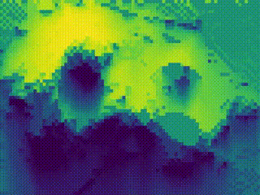
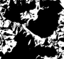
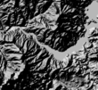
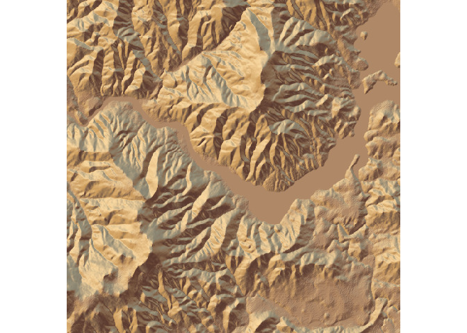
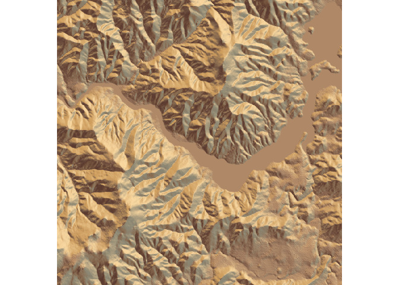
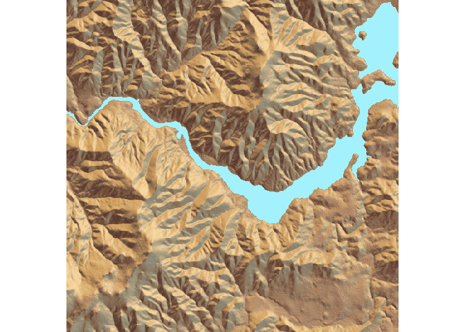
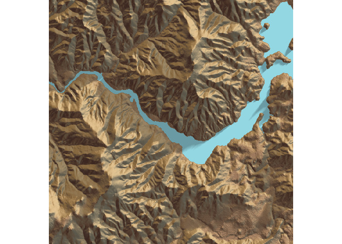
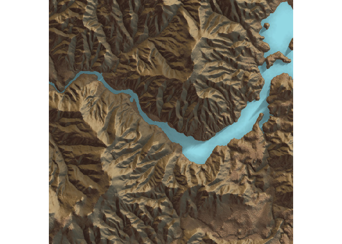
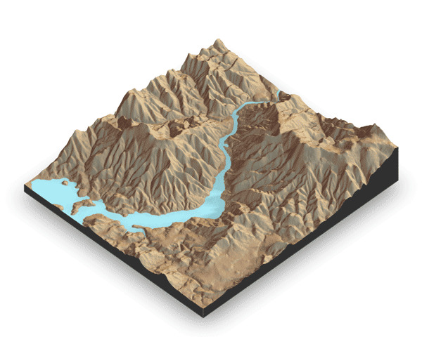
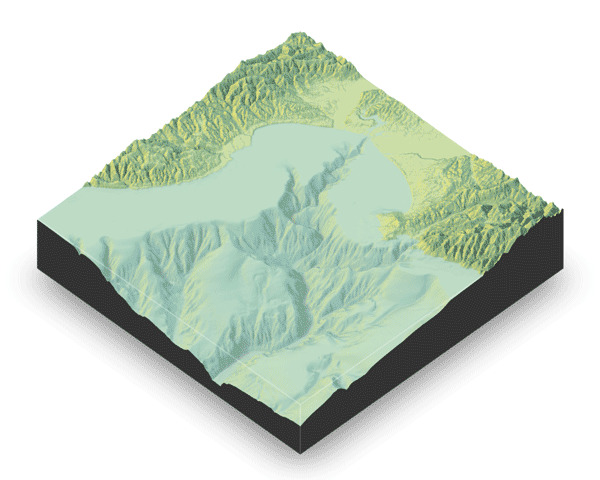

rayshader
=========

</img>

Overview
--------

**rayshader** is an open source package for producing hillshaded maps of elevation matrices with raytracing and spherical texture mapping.

Installation
------------

``` r
# To install the latest version from Github:
# install.packages("devtools")
devtools::install_github("tylermorganwall/rayshader")
```

Functions
---------



Rayshader has five functions related to hillshading:

-   `ray_shade` uses user specified light directions to calculate a global shadow map for an elevation matrix. By default, this also scales the light intensity at each point by the dot product of the mean ray direction and the surface normal (also implemented in function `lamb_shade`, this can be turned off by setting `lambert=FALSE`.
-   `sphere_shade` maps an RGB texture to a hillshade by spherical mapping. A texture can be generated with the `create_texture` function, or loaded from an image. `sphere_shade` also includes 7 built-in palettes: "imhof1","imhof2","imhof3",imhof4","desert","bw","unicorn".
-   `create_texture` programmatically creates texture maps given five colors: a highlight, a shadow, a left fill light, a right fill light, and a center color for flat areas. The user can also optionally specify the colors at the corners, but `create_texture` will interpolate those if they aren't given.
-   `ambient_shade` creates an ambient occlusion shadow layer, darkening areas that have less scattered light from the atmosphere. This results in valleys being darker than flat areas and ridges.
-   `lamb_shade` uses a single user specified light direction to calculate a local shadow map based on the dot product between the surface normal and the light direction for an elevation matrix.
-   `add_shadow` takes two of the shadow maps above and combines them, scaling the second one (or, if the second is an RGB array, the matrix) as specified by the user.

Rayshader also has two functions to detect and add water to maps:

-   `detect_water` uses a flood-fill algorithm to detect bodies of water of a user-specified minimum area.
-   `add_water` uses the output of `detect_water` to add a water color to the map. The user can input their own color, or pass the name of one of the pre-defined palettes from `sphere_shade` to get a matching hue.

And two functions to display and save your maps:

-   `plot_map` Plots the current map. Accepts either a matrix or an array.
-   `write_png` Writes the current map to disk with a user-specified filename.
-   `plot_3d` Creates a 3D map, given a texture and an elevation matrix. You can customize the appearance of the map, as well as add a user-defined water level.

All of these functions are designed to be used with the magrittr pipe `%>%`.

Usage
-----

```r
library(rayshader)
library(magrittr)

#Here, I load a map for the River Derwent in Tasmania with the raster package:
localtif = raster::raster("tasmania.tif")

#And convert it to a matrix:
elmat = matrix(raster::extract(localtif,raster::extent(localtif),buffer=1000),
               nrow=ncol(localtif),ncol=nrow(localtif))

#We use another one of rayshader's built-in textures:
elmat %>%
  sphere_shade(texture = "desert") %>%
  plot_map()
```


```r
#sphere_shade can shift the sun direction:
elmat %>%
  sphere_shade(sunangle = 45, texture = "desert") %>%
  plot_map()
```


```r
#detect_water and add_water adds a water layer to the map:
elmat %>%
  sphere_shade(texture = "desert") %>%
  add_water(detect_water(elmat), color="desert") %>%
  plot_map()
```


``` r
#And we can add a raytraced layer from that sun direction as well:
elmat %>%
  sphere_shade(texture = "desert") %>%
  add_water(detect_water(elmat), color="desert") %>%
  add_shadow(ray_shade(elmat)) %>%
  plot_map()
```


``` r
elmat %>%
  sphere_shade( texture = "desert") %>%
  add_water(detect_water(elmat), color="desert") %>%
  add_shadow(ray_shade(elmat)) %>%
  add_shadow(ambient_shade(elmat)) %>%
  plot_map()
```



Rayshader also supports 3D mapping by passing a texture map (either external or one produced by rayshader) into the `plot_3d` function.

``` r
elmat %>%
  sphere_shade(texture = "desert") %>%
  add_water(detect_water(elmat), color="desert") %>%
  add_shadow(ray_shade(elmat)) %>%
  add_shadow(ambient_shade(elmat)) %>%
  plot_3d(elmat)
```



You can also easily add a water layer by setting `water = TRUE` (and setting `waterdepth` if the water level is not 0). You can customize the appearance and transparancy of the water layer via arguments to `plot_3d`. Here's an example using the built-in example bathymetric/topographic data of Monterey Bay, CA `montereybay` (zscale for a 1-to-1 ratio  using `montereybay` would be 200, but in plot_3d is set to 50 to give a 4x exaggerated height in the z-direction) :

``` r
montereybay %>% 
    sphere_shade(texture = "imhof1") %>% 
    add_shadow(ray_shade(montereybay,zscale=200)) %>%
    add_shadow(ambient_shade(montereybay,zscale=200)) %>%
    plot_3d(montereybay, water=TRUE, zscale=50, theta=-45,
            waterdepth = 0, wateralpha = 0.6, watercolor = "#88DDFF",
            waterlinecolor = "white", waterlinealpha = 0.5)
```


